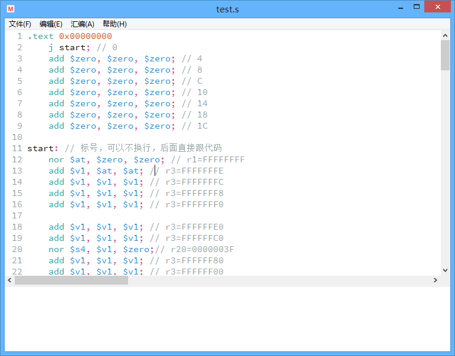
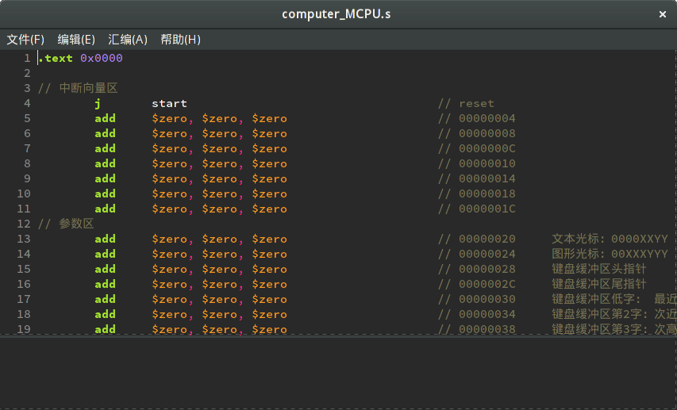

# MIPS 汇编器及集成开发环境

这是我为浙江大学计算机组成课程编写的项目。

MIPS 汇编器主要遵循 MIPS 32 规格说明，并采用了一些自定义的扩展.

MIPS 集成开发环境基于 SWT 构建，并使用 launch4j 打包为 Windows 可执行程序。

## 预览





## 规范

本汇编器参考并主要遵循 MIPS Assembly Language Programmer’s Guide 及 MIPS32 Architecture For Programmers Volume II: The MIPS32 Instruction Set 所包含的规范。

## 指令集

支持以下 95 条指令：

- ADD
- ADDI
- ADDIU
- ADDU
- AND
- ANDI
- B
- BEQ
- BEQL
- BGEZ
- BGEZAL
- BGEZALL
- BGEZL
- BGTZ
- BGTZL
- BLEZ
- BLEZL
- BLTZ
- BLTZAL
- BLTZALL
- BLTZL
- BNE
- BNEL
- BREAK
- COP2
- DERET
- DIV
- DIVU
- ERET
- J
- JAL
- JALR
- JR
- LA
- LB
- LBU
- LDC1
- LDC2
- LH
- LHU
- LI
- LL
- LUI
- LW
- LWC1
- LWC2
- LWL
- LWR
- MFC0
- MFHI
- MFLO
- MOVE
- MOVN
- MOVZ
- MTC0
- MTHI
- MTLO
- MULT
- MULTU
- NOR
- NOP
- OR
- ORI
- PREF
- SB
- SC
- SDC1
- SDC2
- SH
- SLL
- SLLV
- SLT
- SLTI
- SLTIU
- SLTU
- SRA
- SRAV
- SRL
- SRLV
- SUB
- SUBU
- SW
- SWC1
- SWC2
- SWC3
- SWL
- SWR
- TLBP
- TLBR
- TLBWI
- TLBWR
- SYSCALL
- WAIT
- XOR
- XOR

支持以下 10 条伪指令：

- .TEXT
- .DATA
- .ASCII
- .ASCIIZ
- .BYTE
- .HALF
- .WORD
- .SPACE
- .EVAL
- .ECHO

所有操作数均支持 JavaScript 表达式，同时`.EVAL`指令可以直接求值一个 JavaScript 表达式，`.ECHO`可以将 JavaScript 表达式的返回值作为一行 MIPS 代码就地进行汇编。

## 汇编功能

支持完备的错误检查，在参数不合法、立即数超出范围、标签缺失或重复、代码或数据段重叠等情况下输出错误信息。

支持的输出格式包括二进制、COE 和调试输出文件。

支持将旧格式导入至现有格式。

## 反汇编功能

支持以上所有指令所生成的二进制和 COE 文件。

支持标签的反汇编。

支持将二进制中大量 0 压缩为一条`.SPACE`伪指令。

## 命令行功能

支持以下命令格式：

```
usage: mipsasm [OPTION]...
 -g,--graphical       Launch graphical user interface
 -h,--help            Display this help and exit
 -i,--input <FILE>    Read input from FILE
 -o,--output <FILE>   Write output to FILE
 -t,--terminal        Launch in terminal mode
 -w,--writer <TYPE>   Use writer of TYPE. TYPE can be 'binary', 'coe',
                      'debug' (the default), or 'hexdebug'
```

## 图形界面功能

支持在 Windows、Linux、Mac OSX 上使用原生控件显示图形界面。

支持文件、编辑、汇编菜单和相应快捷键。

支持拖拽打开文件。

支持打印。

支持语法高亮、行号显示。

## 示例代码

MIPS 汇编代码：

```mipsasm
# "Hello World" in MIPS assembly
# From: http://labs.cs.upt.ro/labs/so2/html/resources/nachos-doc/mipsf.html

	# All program code is placed after the
	# .text assembler directive
	.text 0x0

# The label 'main' represents the starting point
main:
	# Run the print_string syscall which has code 4
	li	$v0, 4		# Code for syscall: print_string
	la	$a0, msg	# Pointer to string (load the address of msg)
	syscall
	li	$v0, 10		# Code for syscall: exit
	syscall

	# All memory structures are placed after the
	# .data assembler directive
	.data 0x20

	# The .asciiz assembler directive creates
	# an ASCII string in memory terminated by
	# the null character. Note that strings are
	# surrounded by double-quotes

msg:	.asciiz	"Hello World!\n"
```

COE 输出：

```coe
memory_initialization_radix=16;
memory_initialization_vector=
3C020004, 34420000, 3C040020, 34840000, 0000000C, 3C02000A, 34420000, 0000000C,
48656C6C, 6F20576F, 726C6421, 0A000000;
```
